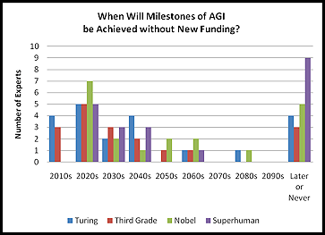
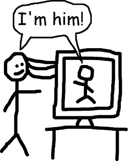
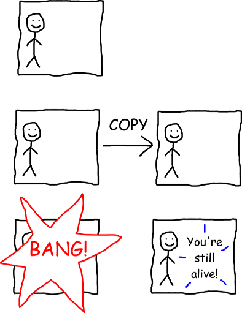
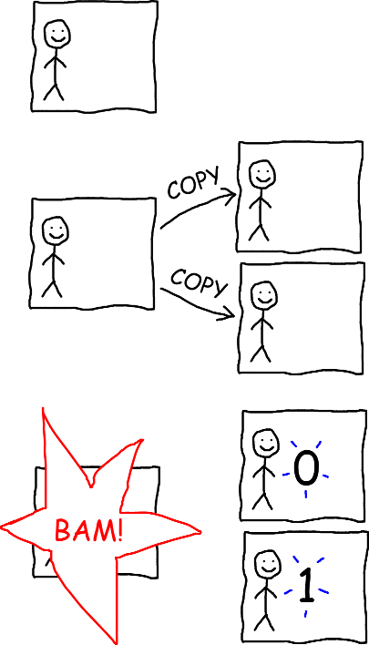
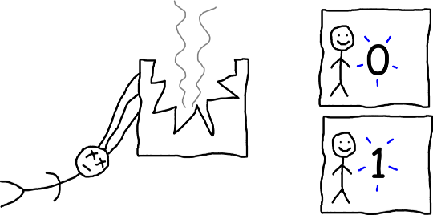
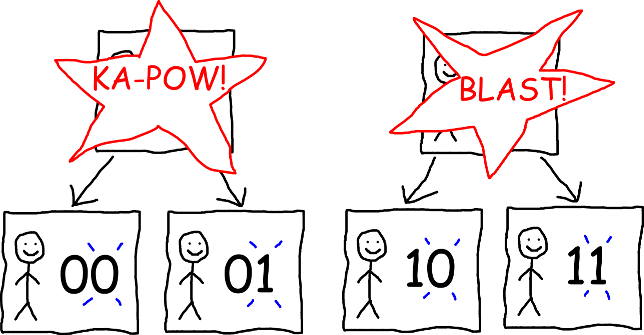
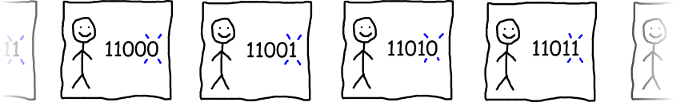

# What learning algorithms can predict that our physics theories might not

A [hot topic](http://fqxi.org/community/essay/winners/2013.1) in physics right now is applying techniques from information theory and theoretical machine learning to better understand physics. There are even hopes that these techniques might develop into a so-called "theory of everything" that unifies and explains all aspects of the universe. But for all the attention this subject has gotten, I'm a bit disappointed that I've never seen an introduction that explains

1. where *exactly* might you be able to use learning algorithms where you can't just use [existing](https://en.wikipedia.org/wiki/Standard_Model) [physics](https://en.wikipedia.org/wiki/General_relativity) theories instead, and
2. a hands on guide to applying learning algorithms in these situations, for people who don't know information theory jargon

So I'm going to write one!

People often describe information physics or digital physics by saying it is something about the [entropy of black holes](http://www.pbs.org/wgbh/nova/blogs/physics/2014/04/is-information-fundamental/), or worse (in my opinion), the idea that [we might be living in a computer simulation](http://www.amnh.org/2016-asimov-debate). While there's a lot of research along those lines, I think it's more important to understand why those ideas are worth studying in the first place. So instead, I'm going to start with the following idea:

> *If* it is possible to put ourselves inside computer simulations, it *might* be possible to put ourselves in a situation where we cannot use existing physics theories to predict what we'll perceive happening to us, but where we can use machine learning algorithms to do so.

But before we get into it, I need to make a couple disclaimers. First, I'm not one of the people doing research in this area, and it's possible that my understanding of what these researchers are doing is completely and utterly wrong. I'm writing this anyway because I think this area is fascinating, and I want other people to be able to appreciate why it is so fascinating. So if you have any questions, comments, or corrections, please email me at [firstestprinciple@gmail.com](mailto:firstestprinciple@gmail.com).

Second, I want to make it very clear that information physics is currently just a *hypothesis* about how the universe works. Unlike more established theories such as the [standard model](http://www.quantumdiaries.org/2010/12/08/known-knowns-of-the-standard-model/) and [general relativity](http://www.feynmanlectures.caltech.edu/II_42.html), we do not know if this is *actually representative* of how the universe works, or even if a new physics theory is needed to explain the situation hinted at above (where I emphasized "if" and "might"). Answering those questions would require serious experimental evidence that is way beyond our capabilities today. But given how quickly our technology is improving, I wouldn't be completely shocked if it is possible in my lifetime.

So first question: how might we be able to put ourselves in a computer simulation?

## Putting ourselves in a computer simulation

If you haven't been living under a rock, you've probably noticed that computers and software have gotten *way* better over the last several decades, and this trend shows no signs of stopping. So [one study](http://hplusmagazine.com/2010/02/05/how-long-till-human-level-ai/) asked a bunch of AI experts when they think computers will become as smart as humans, and more than half predicted that this will happen before 2050.



If the optimists are right, we might see super-smart computers in my lifetime! But even if the pessimists are right, it's fun to speculate about what really powerful computers would be capable of anyway.

{move this down} Virtual reality simulations are already pretty good these days. If computers in 2050 might be smarter than humans, then virtual reality simulations in 2050 might be so good that to a simulated person living in one, it would look pretty convincingly like a real universe.

Instead of speculating about it, could we see for ourselves if that is the case? Perhaps it could be done like this. People have used [brain-to-brain interfaces](https://www.washington.edu/news/2015/09/23/uw-team-links-two-human-brains-for-question-and-answer-experiment/) to think to each other over the internet, and the technology to do things like this is improving quickly. It wouldn't be too much of a stretch to imagine that several decades from now, these brain-to-brain connections might have so much bandwidth {reorder to put 2 half-brains here} that people hooked up this way would feel like a single person. After all, our brains are really just [2 half-brains](https://www.youtube.com/watch?v=wfYbgdo8e-8) that communicate with each other, but we still each feel like a single person. So how would it feel if we hooked up two people's brains together in year 2050?


Better yet, what if we hooked up your brain to a simulated brain in a virtual reality world? Would you feel like you are also the person in the simulation?



We won't know until we actually try it. If the answer is no {impossible} then the rest of this blog post is completely irrelevant, but if the answer is yes {possible} then that would be really cool!

So let's say you do that and you're now a single person that lives in both the real world and a virtual reality world. Then the real world part of you gets into a tragic accident and your brain is blasted into a million pieces. How sad.


But are you really dead? Because, you know, people have done surgeries where they [removed half of someone's brain](https://en.wikipedia.org/wiki/Hemispherectomy) and they still lived on OK. So if half of your brain is in the real world and half of your brain is in a computer simulation and you lose the part of your brain in the real world, shouldn't you still live on in the simulation?

If you try it out and the answer is no, then the rest of this blog post is completely irrelevant. But if the answer is yes, then it means that it's possible to put ourselves completely inside a computer simulation! Isn't that like the coolest thing ever? (If you like this sort of thing, here's a Wait But Why post about [what makes you you](https://waitbutwhy.com/2014/12/what-makes-you-you.html).)

So what does this have to do with information physics? Oh right:

> *If it is possible to put ourselves inside computer simulations*, it might be possible to put ourselves in a situation where we cannot use existing physics theories to predict what we'll perceive happening to us, but where we can use machine learning algorithms to do so.

So now I've explained the first part. But even if you can live completely inside a simulation (and this is already a huge if), the computers running the simulation must still follow the laws of physics. So if you know how the simulation is programmed to behave, you don't need machine learning algorithms to predict what will happen to you. And if you could somehow know [general relativity](https://en.wikipedia.org/wiki/General_relativity), the [standard model](https://en.wikipedia.org/wiki/Standard_Model), and the state of every particle in the universe at the time your real world brain is blasted into a million pieces, then even if someone later decides to change the computer code of the simulation, then in theory you could predict that too. So what do you need learning algorithms for?

## What our physics theories can't predict

One really cool property of computer simulations is that you can make exact copies of them on different computers. If the simulation uses what's called a "[deterministic algorithm](https://en.wikipedia.org/wiki/Deterministic_algorithm)," then it means that all copies of the simulation will output the same thing.

Now let's suppose that after disconnecting your real world brain, the simulation you're living in becomes deterministic, and that 30 seconds from now, it's programmed to display a message to you saying "You're still alive!" But those of us controlling the simulation are evil pranksters, and we decide to play a trick on you. Once the simulation becomes deterministic, we copy it onto a second computer, and right before it displays the "You're still alive!" message, we blast the original computer into a million pieces. Now here's the question: do you get to see the message?



Well, it depends on how we define "you," doesn't it? If we define "you" based on which physical body you're in, or which physical computer you're in, then you "die" in the original computer and don't get to see the message. (Arguably, by that definition, you die even earlier, when your physical human brain is blasted into a million pieces.) But if we instead define "you" in a different way where it doesn't matter which physical body or computer you're in, then maybe you do get to see the message.

But here's the thing. The way science works is that you're supposed to do experiments to figure out what's right and what's wrong. And what we just described here is a way for you to *experimentally determine* which of these definitions of "you" is wrong! How? By using the procedure above to attempt to put yourself in a computer simulation, then having some friends do that trick so that only a copy of the simulated "you" gets to see the "You're still alive!" message. {simplify? the definitions -> definitions} If you die before you see the message, then the definitions of "you" predicting that you see the message are wrong. If you *do* get to see the message, then you know for a fact that the definitions of "you" predicting that you do *not* see the message are most definitely wrong! (One weird thing about this experiment is that people watching the computers from outside don't find out which definitions of "you" are wrong, but they can still reproduce the outcome for themselves by putting themselves inside a simulation.)

I'm going to use the terminology of the [Wait But Why post](https://waitbutwhy.com/2014/12/what-makes-you-you.html) I linked to earlier, and I'm going to call the hypothesis that you *do not* see the message the "brain theory." And I'm going to call the hypothesis that you *do* {is possible to} see the message the "data theory."

As of today, we don't know which hypothesis is right. But think about what it would mean if the data theory is right.

Well, that would mean we get to do an even crazier experiment! Suppose we do the same experiment as above, except for the following:

1. The evil pranksters copy the simulation onto 2 other computers, instead of just 1.
2. The simulation is deterministic, except for one thing: if someone presses a key on the keyboard, you get to see what they pressed from inside the simulation.
3. After the first computer is destroyed, someone presses the `0` key on the second computer, and simultaneously presses the `1` key on the third computer.

Will you see a 0 or a 1?



Easy, right? Isn't there just a 50% chance that you'll see a 0 and a 50% chance that you'll see a 1? Not so fast. Just because there's 2 possibilities doesn't necessarily mean that each one has a 50% chance of occurring. For example, if you consider the possibilities of whether or not you'll be struck by lightning within the next 10 seconds, it is far more likely that you will not be struck by lightning.

Well, then, how about we do this the proper way, and use the fundamental laws of physics to derive what's going to happen? Well, the most fundamental physics theories we know of today are the [standard model of particle physics](http://www.quantumdiaries.org/2010/12/08/known-knowns-of-the-standard-model/) and [general relativity](http://www.feynmanlectures.caltech.edu/II_42.html). And if you do the painstaking calculations, they'll tell you that the outcome of this experiment looks something like this:



Here's the thing. While these theories can give you a probability distribution over what every atom in those computers is going to do, neither of them has a concept of who "you" are. So if you happen to know that "you" are a person being simulated in 2 computers (but you don't know which computer you're in because both copies of you have identical memories), and one version of "you" is going to see a 0 and the other version of "you" is going to see a 1, these theories cannot predict the probabilities of either version being the "real you!"

Of course, if the brain theory is right and you die before you would see either the 0 or the 1, then this doesn't matter. But if the data theory is right and you *do* get to see either the 0 or the 1, then that would mean *it's possible to do an experiment in which the most fundamental physics theories we know of today cannot predict the probabilities of you seeing a 0 or a 1!*

In that case, we'd need a new physics theory to fill the gap.

## Enter the learning algorithms

Remember that at the beginning of this post, I promised to tell you about how people are "applying techniques from information theory and theoretical machine learning to better understand physics?" Well, now I get to tell you about that. But before we get into how you might figure out the probability of seeing a 0 or a 1 in the situation above, let's start with a slightly different question.

Suppose we do the experiment above, and you end up seeing either a 0 or a 1. (I'm going to assume from now on that the data theory is right, though this is still an open question.) But since those of us controlling the simulation are evil pranksters, we play the same trick again on both copies of "you" so that there are now 4 versions of "you:" a version that sees 00, a version that sees 01, a version that sees 10, and a version that sees 11.



Then we play the same trick again, so that there's a version {not singular} of "you" that sees every 3-digit sequence of 0's and 1's. Then we play the same trick again, and again, and so on, until we run out of money to buy more computers. (I imagine computers will be pretty cheap in year 2050.)



Now you can start to see a pattern. Inside the simulation, you see a sequence of 0's and 1's that keeps getting longer and longer. So considering the sequence that you've seen so far, how can you guess whether the next digit will be a 0 or a 1? Great question, and this sounds like a great time to talk about learning algorithms!

## The most badass learning algorithm ever invented

Machine learning is a really big field, and there are way too many learning algorithms to cover them all here. Many of these algorithms exist either to address practical, real-life problems such as performance or perceived theoretical problems such as runtime complexity. But if you are a godlike being who is not concerned with either of these problems (and let's face it, we all wish we were), there is really only one learning algorithm you need to know, and it is called Solomonoff induction.

Here's the problem that Solomonoff induction is designed to solve: suppose there is some unknown process generating a sequence of 0's and 1's (also known as a "bitstring") and you want to guess the next digit (or "bit") in the sequence. (Sounds familiar?)

So how might you do that? Intuitively you'd think that the next bit will probably continue the same pattern as the previous bits, rather than being something "random." But how can you tell how "random" a bitstring is? A subjective but really effective way of doing that is by figuring out what are the [lengths of the shortest computer programs](https://en.wikipedia.org/wiki/Kolmogorov_complexity) that output that bitstring. So let's use this idea to assign a probability to every bitstring.

First we need a way to randomly generate computer programs that produces shorter programs more often than longer programs. Easy! Flip 2 coins. If the first coin lands heads then write a 0; otherwise write a 1. If the second coin lands heads then flip both coins again; otherwise stop. The resulting bitstring is our *computer program*. (We normally read computer code as text, but it is [stored on computers](https://en.wikipedia.org/wiki/Character_encoding) as a bitstring.)

Next we need this computer program to output a bitstring. Simple! Save the computer program as a binary file and run it using a deterministic interpreter for your favorite programming language, perhaps Python or JavaScript. (It doesn't matter which language, as long as it's [Turing complete](https://stackoverflow.com/questions/7284/what-is-turing-complete#7320) and has something like print or console.log that prints to the console. Also you should let the program use unlimited time and memory.) Of course, almost all randomly generated computer programs will have a syntax error, but that's OK because there is still a chance that the program will run and print something. As for the text that the program prints to console (which can also be represented as a bitstring), how about we call it the *console output*.

Now we can assign a probability to every bitstring you might see in the simulation. If you generate and run random computer programs, over and over again for the rest of your life and [a long time beyond](https://en.wikipedia.org/wiki/Heat_death_of_the_universe), we can define the [*algorithmic probability*](http://scholarpedia.org/article/Algorithmic_probability) of a bitstring to be the number of *console outputs* so far (counting duplicates) that *begin* with the bitstring in question, divided by *total* number of console outputs so far (counting duplicates), as the number of programs that finish running approaches infinity.

Finally, you can use these concepts to predict whether you'll see a 0 or 1 next. According to [*Solomonoff induction*](http://lesswrong.com/lw/dhg/an_intuitive_explanation_of_solomonoff_induction/) ([alternate link](http://twistedoakstudios.com/blog/Post5623_solomonoffs-mad-scientist)), the probability of seeing a 0 next is:

```
 algorithmic probability of the bitstring you've seen so far followed by 0
----------------------------------------------------------------------------
(algorithmic probability of the bitstring you've seen so far followed by 0 +
 algorithmic probability of the bitstring you've seen so far followed by 1)
```

And the probability of seeing a 1 next is just one minus the probability of seeing a 0 next.

Phew, that was a mouthful! If you like, here's a flowchart:

```
the
extremely patient [1] person's
guide to
THE MOST BADASS LEARNING ALGORITHM
EVER INVENTED

  Start
    |
    v
*Flip* 2 coins <---  <-------------------------
    |              |                           |
    v              |                           |
If first coin is:  |                           |
{heads} -> write 0 |                           |
{tails} -> write 1 |                           |
    |           ---                            |
    |    Second coin is {heads}                |
    | Second coin is {tails}                   |
    v                                          |
Save bits as a *binary file*                   |
00001010 -> random_program.bin                 |
    |                                          |
    v                                          |
*Execute* it as a computer program [2]         |
python random_program.bin > console_output.bin |
    |                                          |
    v                                          |
When it starts executing,                      |
get a new sheet of paper and...                |
    |                        ------------------
    |                   Do until the end of time
    | When time ends
    v
Given a bitstring *B*:
                                 # of console outputs (counting duplicates) that begin with *B*
algorithmic probability of *B* = --------------------------------------------------------------
                                 total # of console outputs (counting duplicates)
    |
    v
Given a bitstring *C*: {put box or blue highlight around this}
                                  algorithmic probability of *C* followed by 0
probability that next bit is 0 = -----------------------------------------------
                                 (algorithmic probability of *C* followed by 0 +
                                  algorithmic probability of *C* followed by 1)

probability that next bit is 1 = 1 - probability that next bit is 0
```

[1] "Extremely patient" is like the biggest understatement ever.

[2] Let the program use unlimited time and memory, and deterministically generate anything that could potentially be nondeterministic (such as user input).

That's a crazy-looking algorithm, isn't it? But you may still be wondering what's so badass about it. Well, imagine a computer like the ones today, except that this computer has an infinite amount of disk space, access to a truly random number source (as opposed to an imperfect [pseudorandom number generator](https://en.wikipedia.org/wiki/Pseudorandom_number_generator)), and can do computations forever without making a mistake. One of the deep results of information theory is that if the underlying process that "chooses" whether you see a 0 or 1 could in theory be simulated by such a computer, then as the sequence of 0's and 1's you observe gets longer and longer, the probabilities of future observations predicted by Solomonoff induction will converge towards the "fundamental" underlying probabilities.

Is there any sequence that Solomonoff induction *cannot* predict? Yes there is! One example would be a sequence generated by looping over every possible program in your favorite Turing complete programming language, and for each program, [displaying 0 if it would run forever](http://www.scottaaronson.com/democritus/lec3.html) and displaying 1 otherwise. So if we can ever calculate that sequence then it would mean that Solomonoff induction is not the best possible learning algorithm we could use, but that said, we currently [do not have any serious reason](https://en.wikipedia.org/wiki/Church-Turing_thesis) to think that this is possbile.

## Predicting the first digit, and other stuff too

Since Solomonoff induction is a learning algorithm, it only gives meaningful predictions after it has some measurements to learn from. So how could you approach the problem of predicting whether the very first digit you see in the simulation will be a 0 or a 1?

Thankfully, there's still a lot of prior knowledge you can take advantage of. For example, one thing you could do is take a video recording of everything you see inside the simulation, and use Solomonoff induction to predict how it will continue. Since video recordings are ultimately stored on your computer as 0's and 1's, it is still possible to run Solomonoff induction on them (in theory at least, though you'd want to use a different variation than the one I described in order to predict more than 1 bit at a time), and all of the same guarantees about its accuracy will still apply.

In fact, instead of waiting until 2050 to run Solomonoff induction, how about using it today? Obviously we would have to use an approximation of the algorithm in order to make predictions in a reasonable amount of time, but at least one group of researchers has done that to build an [AI agent](https://arxiv.org/abs/0909.0801) that [plays Pac-Man](https://www.youtube.com/watch?v=yfsMHtmGDKE). Of course, if you're building a machine learning model in real life, there's many factors that are more important than whether the algorithm is theoretically optimal, but that discussion is way outside the scope of this blog post.

{embed video?}

So if Solomonoff induction is truly that badass, then what about taking this all the way and suggesting that it might in fact be the ["theory of everything"](https://en.wikipedia.org/wiki/Theory_of_everything) that unifies and explains all aspects of the universe? Such a statement would imply deep things about the fundamental nature of the universe, and there is in fact an [area of research](https://en.wikipedia.org/wiki/Digital_physics) along these lines, though as of today it is quite a [controversial idea](https://en.wikipedia.org/wiki/Digital_physics#Criticism). But the more general idea of applying information theory concepts to study physics is a [major area of research](http://fqxi.org/community/essay/winners/2013.1) currently.

## The technological singularity

The world has changed a lot in the last few decades. But haven't you noticed that not only has the world changed a lot, but that the rate of change is accelerating?

Why is that? It's because we find ways to make our technology better. Then we use the new technology to make our technology even better, faster than we did the first time. Then we use *that* new technology to make our technology even *more* better, faster than we did it the *second* time. So what if this keeps happening? If we take this to the logical conclusion, doesn't it mean that we'd eventually reach a point where our technology improves so quickly that we rapidly evolve into a completely new, super-smart species?

People call this hypothetical event the *technological singularity* [link], and the only thing we know for sure about it is that we don't have a BLEEPing clue what will happen when it occurs. I think these recent physics developments demonstrate the degree to which this is true. We don't just not know what will happen socially, biologically, or technologically. We don't even know what could happen on the level of fundamental physics!

Obviously, I think we need to do a lot more research about what sorts of things will be possible when the technological singularity occurs, so we will be better prepared when it happens. But here's what I hope will happen:

Remember the first stick figure drawing in this blog post, which speculated that if we connected 2 people's brains as effectively as the neural fibers that connect the 2 halves of our brains, they might feel like a single person?


What if instead of connecting just 2 people's brains together, we connected everyone's brains like that to the internet? Would that mean that every human being on Earth would feel like they are just one small body part of a single, greater being?

We won't know until we actually try it. But if the answer is yes, then it would mean that we'd finally be able to say "I am superhuman."

{I'm superhuman!}

Questions? Comments? Found a mistake? Email me at [firstestprinciple@gmail.com](mailto:firstestprinciple@gmail.com).

{email header, CC0}
